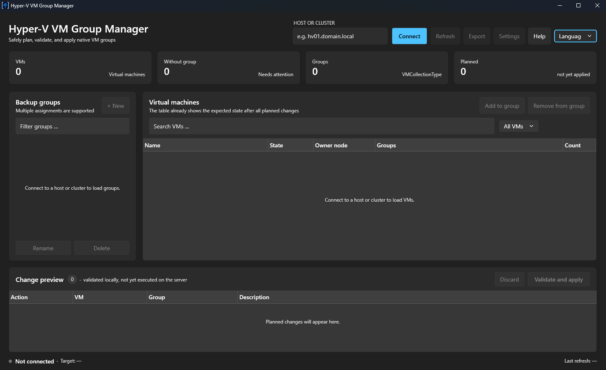

# Hyper-V VM Group Manager

A portable Windows desktop application (WPF, .NET 10) for managing **native Hyper-V VM groups**
(`VMCollectionType`) on standalone Hyper-V hosts and failover clusters.

The workflow is inspired by vSphere tags: a VM can belong to multiple groups, and memberships can
be added or removed without affecting its other group assignments. These groups are designed to be
used as stable VM selection objects in Veeam Backup & Replication. The application does not modify
Veeam configuration or backup jobs.

## Screenshot



## Quick start

```powershell
dotnet build HyperVGroupManager.sln
dotnet test HyperVGroupManager.sln
dotnet run --project src\HyperVGroupManager.App
```

## Automated GitHub releases

One command validates, commits, pushes, tags, and starts the GitHub release workflow; no local GitHub
CLI installation is required:

```powershell
# Use the current unreleased project version, or increment the patch after an existing release tag
.\scripts\New-Release.ps1

# Override the version and optional commit message
.\scripts\New-Release.ps1 -Version 1.0.0 -CommitMessage "release: version 1.0.0"
```

The script updates all version fields, runs the tests, builds the MSI as a release check, stages and
commits all non-ignored changes, pushes the current branch, and pushes the matching version tag. If
the current project version has not been tagged yet, it is used as-is; otherwise the patch number is
incremented automatically. Potentially sensitive untracked files and diverged remote branches stop
the release before anything is committed. The tag triggers a workflow that publishes a portable
Windows ZIP, an MSI installer, and their SHA-256 checksums to GitHub Releases. The script waits for
that workflow and verifies all three assets before reporting success. Release notes are generated
automatically from the commits since the previous release. Use `-NoWait` to return immediately after
the tag push, or `-ReleaseTimeoutMinutes 30` to change the default 20-minute timeout. Private
repositories require `GH_TOKEN` or `GITHUB_TOKEN` for the verification API.

## Windows installer

The portable ZIP remains available. For managed Windows installations, build the MSI locally with:

```powershell
.\scripts\Build-Installer.ps1
```

The MSI installs the application for all users under `%ProgramFiles%\HyperVGroupManager`, creates a
Start menu shortcut, supports major upgrades, and blocks downgrades. A desktop shortcut can be
selected in the installer's feature selection. Silent enterprise installation is supported:

```powershell
msiexec.exe /i HyperVGroupManager-<version>-win-x64.msi /qn /norestart
```

The installer build is intentionally pinned to WiX 5.0.2. WiX 6 and later are subject to the
Open Source Maintenance Fee terms, so upgrading the toolchain requires a separate license review.
WiX 5 no longer receives upstream support; reassess this trade-off before a production rollout.

For more information, see the [usage guide](docs/usage.md),
[architecture documentation](docs/architecture.md), and
[PowerShell JSON contract](docs/powershell-json-contract.md).

## Project structure

* `src/HyperVGroupManager.App` — WPF application using MVVM and CommunityToolkit.Mvvm
* `src/HyperVGroupManager.Core` — models, interfaces, and domain logic without WPF or PowerShell dependencies
* `src/HyperVGroupManager.PowerShell` — PowerShell backend module for Windows PowerShell 5.1
* `tests/HyperVGroupManager.Tests` — xUnit tests; tests never execute real Hyper-V operations

## Safety principles

* The application **does not modify Veeam jobs** and does not access the Veeam API.
* It manages only native Hyper-V VM groups of type `VMCollectionType`.
* It does not use `Invoke-Expression` or dynamically concatenate PowerShell source code.
* Parameters are transferred exclusively through JSON files, never through command-line arguments.
* Change sets are validated in C# and again by the PowerShell module before execution.
* Every change set is bound to the connected target. Switching targets while changes are pending is blocked.
* SMTP passwords are never logged and are encrypted for the current Windows user with DPAPI.

## What's new in 0.2

* Native Fluent WPF interface with system light/dark mode and Windows accent colors
* Preview of the expected state, including all changes that have not yet been applied
* VMs can be assigned to newly planned groups within the same change run
* Groups can be deleted safely after all membership removals have been planned
* Complete preflight validation, backend response correlation, and a safety lock for uncertain server state
* Hardened PowerShell bootstrap with a command allowlist and input/output limits

## What's new in 0.3

* Integrated documentation through the Help button or `F1`
* Runtime language switching between German and English with a persistent per-user preference

## What's new in 0.3.1

* Consistent light/dark templates for buttons, text fields, password fields, and drop-downs
* Connection-aware action states and safe disabling of apply operations without pending changes
* Search placeholders and contextual empty-state messages
* Visual VM change markers with added, removed, and renamed group badges

## What's new in 0.4

* Runtime appearance selection with System, Dark, and Light modes
* Native Fluent title-bar and control updates without restarting the application
* Persistent per-user theme preference without modifying the portable application directory

## What's new in 0.4.1

* Refreshed application branding across the executable, windows, taskbar, and notification area
* Tray shortcut for restoring or closing the application

## What's new in 0.5

* Optional per-machine MSI installer alongside the unchanged portable ZIP distribution
* Start menu integration, optional desktop shortcut, clean uninstall, and guarded major upgrades
* Automated GitHub release assets for ZIP, MSI, and SHA-256 verification

## MVP scope

Included: native `VMCollectionType` groups on standalone hosts and clusters, multiple group
memberships, validated changes with an effective-state preview, JSON export, and scheduled email
reports for VMs without a group assignment.

Out of scope: Veeam API integration, `ManagementCollectionType`, nested groups, SCVMM,
Active Directory authentication, and automatic updates.

## License

This project is licensed under the [MIT License](LICENSE).
